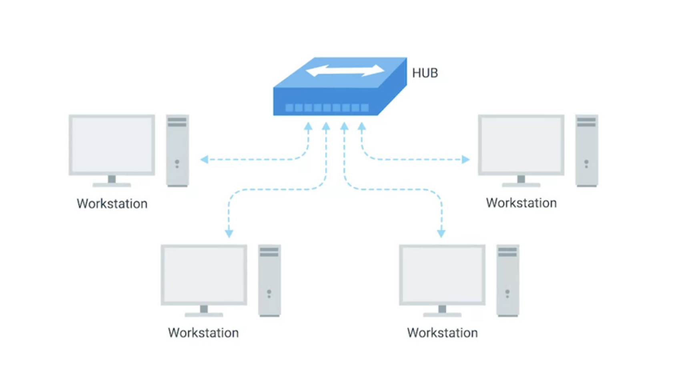
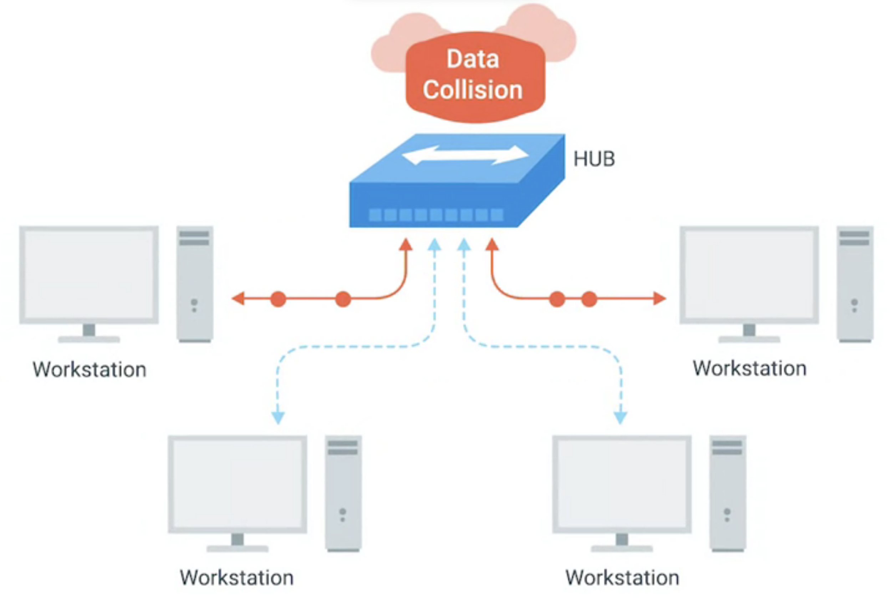
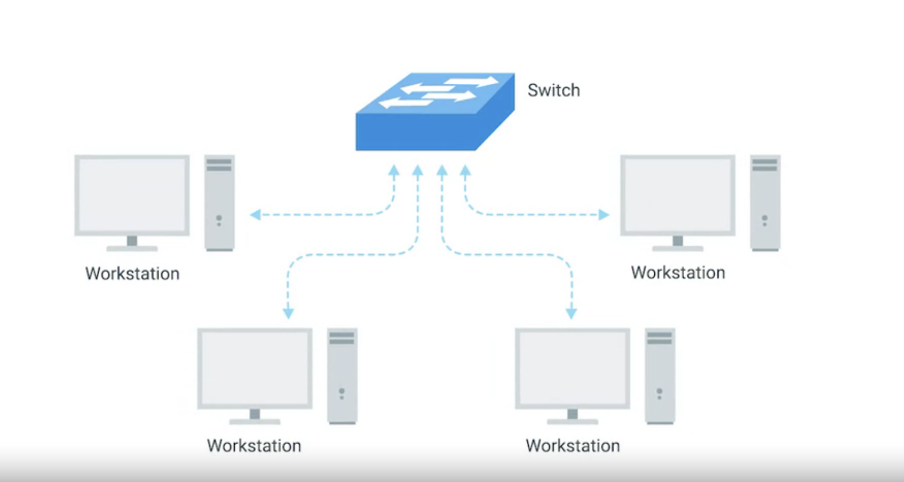

## 计算机网络快速入门[2]-网络设备-电缆、集线器、交换机、路由器

## 前文
* [计算机网络快速入门[1]-前言](https://zhuanlan.zhihu.com/p/107658283)

## 前言
* 在上节中介绍了计算机网络快速入门写作的初衷、计算机网络的内涵以及计算机网络5层模型与ISO7层网络模型
* 可以使用许多不同的电缆和网络设备来使计算机彼此正确通信。在本文结束后，您将能够识别和描述各种网络电缆和网络设备。

## 电缆(Cables)
了解如何区分不同的网络设备对于您的成功至关重要。让我们从有线网络的最基本组件`电缆`开始
* 电缆可以将不同的设备彼此连接，从而可以通过它们传输数据。当今使用的大多数网络电缆可以分为铜缆和光纤两类。
* 铜缆是网络电缆的最常见形式。它们由塑料绝缘体内的多对铜线组成。您可能已经知道，计算机以二进制形式通信，人们用一和零表示。发送设备通过在两个范围之间更改电压来在这些铜线上传输二进制数据。
* 接收端的系统能够将这些电压变化解释为二进制1和0，然后可以将其转换为不同形式的数据。网络中使用的最常见的铜双绞线电缆是Cat5，Cat5e和Cat6电缆。这些都是表示第五类或第六类电缆的简写方式。
* 这些类别具有不同的物理特性，例如一对铜线中的绞合数会导致不同的可用长度和传输速率。 Cat5较旧，大部分已被Cat5e和Cat6电缆取代。从外部看，它们看上去几乎相同，要知道的重要一点是，双绞线在这些电缆内部的布置方式的差异会极大地改变数据在电缆上的发送速度以及这些信号对外部干扰的抵抗力。
* Cat5e电缆已基本取​​代了那些较旧的Cat5电缆，因为它们的内部结构减少了串扰（crosstalk）。串扰是指在一根导线上意外检测到另一根导线上的电脉冲时的情况。因此，接收端无法理解导致网络错误的数据。更高级别的协议具有检测丢失的数据并再次请求数据的方法，但是，这会占用更多时间。
* Cat5e电缆的更高质量规格使其不太可能需要重新传输数据。这意味着平均而言，您可以期望在相同的时间内传输更多的数据。 Cat6电缆遵循更加严格的规格以避免串扰，从而使这些电缆更加昂贵。与Cat5e电缆相比，Cat6电缆可以更快，更可靠地传输数据，但是由于其内部结构，以更高的速度使用时，它们的最大距离更短。
* 网络电缆的第二种主要形式称为光纤，是光纤电缆的缩写。光纤电缆包含单独的光纤，这些光纤是由玻璃制成的细管，其长度与人的头发差不多。这些玻璃管可以传输光束。与使用电压的铜不同，光缆使用光脉冲来表示基础数据的一和零。光纤有时甚至还专门用于外部来源产生大量电磁干扰的环境，因为这会影响跨铜线发送的数据。
* 光纤电缆通常可以比铜电缆更快地传输数据，但它们昂贵且易碎。光纤还可以比铜缆传输更长的距离，而不会造成潜在的数据丢失。现在，您对光缆的优缺点有了更多的了解，但是请记住，与办公室或家庭中相比，您更有可能在计算机数据中心（data center）中遇到光缆。

## 集线器(hub)
* 电缆使您可以形成点对点网络连接。在这些网络中，链路两端只有一个设备。但在拥有数十亿台计算机的世界中，它们并不是非常有用。幸运的是，存在允许许多计算机相互通信的网络设备。这些设备中最简单的是集线器。
* 集线器是一种物理层设备，它允许一次从多台计算机进行连接。连接到集线器的所有设备最终将同时与所有其他设备通信。

连接到集线器的每个系统确定传入的数据是否是其需要的，如果不是，则忽略它。这会在网络上造成大量无用信息，并产生所谓的冲突域，如下图所示。

冲突域是一次只能有一个设备进行通信的网段。如果多个系统尝试同时发送数据，则通过电缆发送的电脉冲可能会相互干扰。这导致这些系统必须等待一段安静的时间，然后才能再次尝试发送数据。这减慢了网络通信的速度，并且是集线器很少见的主要原因。今天，它们大多是历史文物。

## 交换机(network switch)
* 连接多台计算机的一种更常见的方式是使用更复杂的设备——网络交换机，该设备最初称为交换集线器。

* 交换机与集线器非常相似，因为您可以将许多设备连接到它，以便它们可以通信。区别在于，集线器是第1层即物理层设备，而交换机是第2层即数据链路设备。如下图所示。

* 这意味着交换机实际上可以检查通过网络发送的以太网协议数据的内容，确定该数据打算用于哪个系统，然后仅将数据发送到该系统。这减少或完全消除了网络上冲突域的大小，导致更少的失败和更高的整体吞吐量。

## 客户端与服务器
* 您刚刚了解的所有网络设备都为了计算机可以相互通信，无论它们是在同一个房间内还是相距数千英里。我们一直称这些设备为节点（notes）
* 了解服务器和客户端的概念也很重要。可以将服务器理解为将数据提供给请求数据的对象。接收数据的对象称为客户端。虽然我们经常谈论节点是服务器还是客户端，但是我们的定义之所以用词含糊不清是因为节点可以是服务器或客户端。在同一节点上运行的各个计算机程序也可以是彼此的服务器和客户端，并且大多数设备并非纯粹是服务器或客户端。

* 在大多数网络拓扑中，每个节点主要是服务器或客户端。有时我们将电子邮件服务器称为电子邮件服务器，即使它本身是DNS服务器的客户端。为什么？因为其存在的主要原因是将数据提供给客户端。同样，如果从一台台式机偶尔向其提供数据到另一台计算机的角度来看，它也充当服务器，则其存在的主要原因是从服务器获取数据，以便计算机上的用户可以执行其工作。所以，服务器就是可以为客户端提供数据的任何设备。

## 路由器
* 集线器和交换机是用于连接单个网络（通常称为LAN或局域网）上的计算机的主要设备。但是我们经常想向其他网络上的计算机发送或接收数据。这是路由器（route）发挥作用的地方。
* 路由器是一种知道如何在独立网络之间转发数据的设备。集线器是第一层设备，而交换机是第二层设备。路由器在第三层（网络层）运行。就像交换机可以检查以太网数据来确定将数据发送到哪里一样，路由器可以检查IP数据来确定将数据发送到哪里。
* 路由器存储内部表，该表包含有关如何在全球许多不同网络之间路由流量的信息。您将看到的最常见的路由器类型是用于家庭网络或小型办公室的路由器。这些设备通常没有非常详细的路由表。这些路由器的目的主要是仅接收来自家庭或办公室LAN内部的流量，并将其转发给ISP或Internet服务提供商。一旦流量到达ISP，一种更复杂的路由器便会接管。这些核心路由器构成了Internet的骨干网，直接负责我们每天如何在Internet上发送和接收数据。
* 核心ISP路由器不仅处理比家庭或小型办公室路由器更多的流量。在决定将流量发送到哪里时，他们还必须处理更多的复杂性。核心路由器通常与许多其他路由器具有许多不同的连接。
* 路由器通过称为边界网关协议（BGP,Border Gateway Protocol）彼此共享数据。这样一来，他们就可以了解转发流量的最佳路径。当您打开Web浏览器并加载网页时，计算机和Web服务器之间的流量可能会经过数十个不同的路由器。互联网异常庞大且复杂。路由器是将流量吸引到正确位置的全球指南。

## 参考资料
* [项目链接](https://github.com/dreamerjackson/theWayToGolang)
* [作者知乎](https://www.zhihu.com/people/ke-ai-de-xiao-tu-ji-71)
* [blog](https://dreamerjonson.com/)